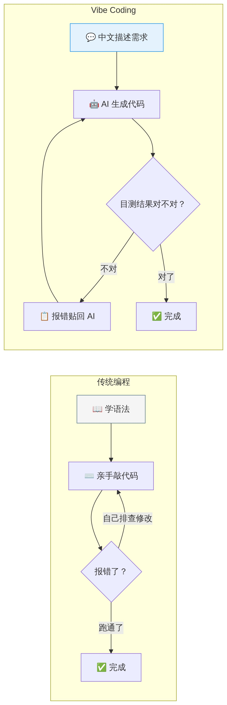
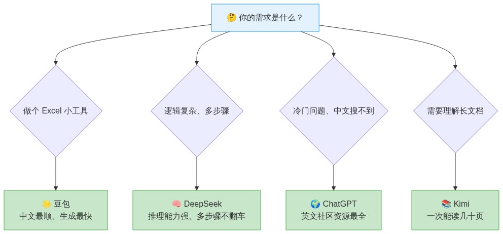
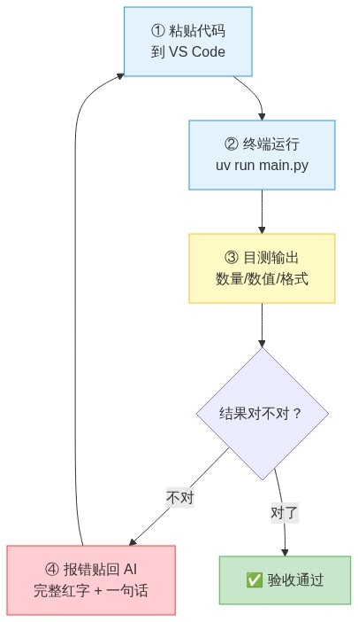

# 2.1 Vibe Coding（氛围编程）：用中文说话，让 AI 替你写代码

> 💡 你在第 1.4 章已经学会了 `uv init`、`uv add`、`uv run` 等工程基建操作——本章教你**把基建用起来**：用中文指挥 AI，让它帮你写代码。

---

## 引子：什么是 Vibe Coding（氛围编程）

2025 年初，前 Tesla AI 总监、OpenAI 联合创始人 **Andrej Karpathy** 提出了一个概念，叫 **Vibe Coding**（氛围编程）。他用一句话总结：

> "完全沉浸到氛围里，拥抱指数增长，忘记代码的存在。"

翻译成大白话：**你不用亲手写代码，不用记语法——但你必须对结果负责。**

> ⚠️ **Vibe Coding 绝不等于"不需要动脑子"。** 恰恰相反：当写代码的体力活被 AI 承包后，对你逻辑思维的要求反而达到了史无前例的高度。AI 在处理复杂数据时，可能会悄悄漏掉空值、算错财务公式、丢列、吞行。程序不报错，输出的表格看起来整整齐齐——但数据底层可能是错的。**在不报错的情况下输出错误结果，是 AI 编程最隐蔽的坑。** 你必须是最后的质量底线：死死卡住数量核对、极值对齐、业务规则验收。你不用懂 `import pandas`，但你必须比 AI 更懂你自己的业务边界。

| | 传统编程 | Vibe Coding |
|---|---------|-------------|
| **你需要做什么** | 学语法、记函数名、亲手敲代码 | 用中文描述你想要什么 |
| **代码从哪来** | 你一个字一个字敲的 | AI 生成的，你只负责验收 |
| **报错了怎么办** | 自己排查、自己改 | 把红字复制粘贴回 AI，让它自己修 |
| **你掌控什么** | 每一行代码 | 只掌控"输入"（你的需求）和"输出"（结果对不对） |



### 这套手册的本质：教你用 Vibe Coding 的方式干活

你不需要成为程序员。你只需要学会三件事：

1. **把需求说清楚** —— 告诉 AI 你的表格长什么样、想算出什么结果
2. **把结果验明白** —— 输出对不对，用你的业务经验目测就行
3. **报错了不慌** —— 把红字贴回去，AI 自己修

Vibe Coding 不是"随便写写"，而是一种已经被全球数百万开发者验证有效的**新工作范式**。在这套手册的语境下，它是你驾驭 AI 帮你干活的底层方法论。

---

## 一、选择你的 Vibe Coding 工具

你不需要学写字，你只需要知道哪台打印机适合打什么。

### 1. 网页对话式 AI：打开浏览器就能用

打开浏览器，在对话框里用**中文**描述你的需求，AI 直接给你返回一整段写好的代码。

| 工具 | 网址 | 免费额度 | 最擅长什么 |
|------|------|---------|-----------|
| **豆包 AI 编程** | doubao.com/chat/coding | **完全免费**，无次数限制 | 中文理解最好，网页和小工具生成最快，零基础首选 |
| **DeepSeek** | chat.deepseek.com | **完全免费**，无次数限制 | 逻辑推理强，复杂数据处理、多步骤任务 |
| **ChatGPT** | chatgpt.com | GPT-5 mini 免费 | 英文社区资料多，遇到偏门技术问题答案最全 |
| **Gemini** | gemini.google.com | 每日免费额度大，日常用不完 | 配合 Google 搜索，能查到最新的第三方库 |
| **Kimi** | kimi.moonshot.cn | 免费 | 一次能读几十页文档，适合"帮我理解这篇说明书" |

**什么时候用哪个？**



> 💡 **不需要只用一个。** 同一个需求，复制粘贴到两个不同的 AI 里，看谁给的结果更好——用更好的那一个。反正都免费。

### 2. 内置 AI 的编程软件：一步到位

上面说的网页 AI 需要你**复制代码 → 粘贴到编程软件里**。下面这些工具把 AI 直接做进了编程软件里——你在里面说话，它帮你写、帮你跑、帮你改。

| 工具 | 你需要做什么 | 免费额度 | 适合谁 |
|------|------------|---------|--------|
| **豆包 MarsCode** | 下载安装，用中文说话 | **完全免费** | 零基础。字节出品，中文原生。打开就能用 |
| **Trae**（字节跳动） | 下载安装 IDE | **完全免费** | 零基础。内置 Claude + GPT-4o，中文对话，直接出结果 |
| **VS Code + Copilot** | 安装 VS Code + Copilot 插件 | 每月 2000 次补全 + 50 次对话 | 有基础。需要先按第一章配好环境 |

> ⚠️ **零基础建议**：豆包网页版 或 Trae。不需要配任何环境——下载 → 打开 → 说话 → 出结果。全程不碰一行代码。

### 3. 为什么不用本地部署的 AI

你可能听人说过"在自己电脑上跑 AI，不花钱还保护隐私"。

**暂时别碰。** 本地部署需要一台性能不错的电脑（至少 16GB 内存 + 独立显卡 6GB 以上），而且本地跑的模型**比云端免费的差得多**。云端免费的 DeepSeek、豆包，质量比你能在自己电脑上跑的最强模型高一个量级。

> ⚠️ 在确认"AI 确实能帮我干活"之前，不要花时间折腾本地部署。那是技术爱好者玩的，不是你今天需要的。

### 4. Agent 模式：AI 自己动手干活

上面说的都是你**发一段话 → AI 回一段代码**。还有一种叫 **Agent 模式**——你发一个任务，AI 自己打开文件、写代码、跑起来看对不对、改错、再跑——整个过程你看它干活就行。Agent 模式是 Vibe Coding 的终极形态，但上手门槛也更高。

- **Copilot Agent**（VS Code 插件）：你说"帮我写个程序处理这个表格"，它自己在编辑器里建文件、写代码、跑终端。**需要 VS Code 环境配好（第一章）**
- **Codex CLI / Claude Code**：终端里用的，**需要技术基础，不推荐新手**

> 👉 **进阶阅读**：当你已经把网页版 AI 用熟了、想更进一步让 AI 在你的项目里自己动手干活，请跳转到 **[Agent 模式详解](./agent-guide.md)**——完整的工具选择、防坑指南和实操教学。

---

## 二、如何用中文描述需求：让 AI 一次写对的五个技巧

你不会写 Python，但你比任何 AI 都懂你的业务：你知道表格里哪列是"构件编号"、哪列是"检测结果"、什么值算正常什么算异常。AI 需要的就是这些信息。

### 技巧 1：说清楚"我给你什么，我要你返回什么"

不需要说"用 pandas 读取 Excel"——你只需要说：

```
✅ "我有一个 Excel 文件，里面有三个列：姓名、部门、工资。
   帮我写一个 Python 程序，统计每个部门的平均工资，
   结果保存为一个新的 Excel 文件。"
```

而不是：

```
❌ "用 pandas 读 Excel 然后 groupby 再 agg"
```
——这种写法你已经自己在替 AI 做技术选型了。不需要。让 AI 决定用什么方法。

### 技巧 2：给例子——越具体，AI 越准

AI 最擅长**模仿**。如果你能给出一个小例子说明"这样的输入 → 这样的输出"，AI 的准确率会高很多。

```
✅ "帮我写一个分类程序。规则是：
   分数 90-100 → '优秀'
   分数 70-89  → '良好'
   分数 60-69  → '及格'
   60 以下     → '不及格'
   比如输入 85 应该返回 '良好'。"
```

### 技巧 3：分步提需求 + 先说人话，再写代码

人对新人的本能是"全部交代清楚怕漏了"。但给 AI 反而效果差——需求太多它会丢三落四。

```
❌ 一次性扔出去：
  "帮我写个程序：读取所有 Excel → 合并 → 去重 → 排序 →
   过滤负数 → 分组统计 → 画图 → 生成 PDF 报告。"

✅ 拆成多个对话：
  第 1 次："帮我写个程序，读取文件夹里所有 Excel 文件，显示读取了哪些文件"
  → 跑通确认 → 
  第 2 次："接着上个程序，把这些文件合并成一张总表，去除完全相同的行"
  → 跑通确认 → 
  第 3 次：...以此类推
```

**补充一个非常管用的话术**：如果任务稍微复杂一点，AI 一上来就吐几百行代码，你看到密密麻麻的代码会慌——不知道它写得对不对、不知道从哪看起。这时候加上一句：

```
先不要直接写代码。请先用大白话告诉我，你打算分哪几步来实现我的需求？
等我确认逻辑没问题了，你再开始写。
```

这相当于你让 AI **先把解题思路讲给你听**，你点头了它再动手。你不需要懂代码，你只需要用你的业务直觉判断——"嗯，先合并再计算再汇总，这个顺序合理"或"不对，应该先去重再合并"。**这一步让你始终感觉自己是个发号施令的老板，而不是被代码牵着走的看客。**

### 技巧 4：告诉 AI 你的电脑环境

每次问 AI 之前花 10 秒抄上你的环境信息：

```
我用的是 Windows 系统，Python 3.12。
项目文件夹在 D:/CodeProjects/my-project/
数据文件放在 data/ 文件夹里，输出文件放在 output/ 文件夹里。
```

> 💡 把这段话存成记事本，每次开新对话直接复制粘贴，省得反复打。

### 技巧 5：加一句"防爆雷话术"——让程序不崩溃

小白最怕什么？不是报错——是程序跑到一半突然崩溃弹红字，完全不知道发生了什么。

但其实你可以在提需求时，一句话预防 80% 的崩溃。每次描述完需求后，加上这样一句"护身符"：

```
数据里可能有空行或者填错的格式。如果遇到这种情况，不要报错停止，
帮我跳过那一行，并在最后告诉我跳过了哪些行、为什么跳过。
```

加上这句话后，AI 会自动在代码里写入"遇到异常 → 跳过 → 记录 → 继续跑"的逻辑。你不再被突然的红字打断——程序跑完后，你看到的是一条条清晰的跳过记录，而不是满屏让人心慌的 Traceback。

> 💡 **这其实就是工程师说的"防御性编程"，但你不是工程师——你不需要知道什么 try-except，你只需要记住这句话，每次提问带上它。**

---

## 三、拿到 AI 给的代码之后：四步验收

AI 给出的代码，直接拿去用 = 闭着眼踩油门。按下面四步走一遍。



### 第 1 步：粘贴到正确的位置

AI 给你的代码，粘贴到 VS Code 里。如果你按第一章配好了环境，代码放在 `src/你的项目名/` 文件夹里，保存为 `.py` 结尾的文件。

### 第 2 步：在终端里跑一次

```bash
uv run python src/你的文件.py
```

按回车。如果没报错、有输出——✅ 初步过关。

### 第 3 步：目测输出对不对

**这一步最关键，也是 AI 替你干不了的。** 用你的业务知识检查：

| 检查项 | 你不需要懂代码，目测就行 |
|--------|------------------------|
| **数量对不对？** | 你的表有 100 行，AI 输出只有 80 条——丢了数据 |
| **数字合理吗？** | 工资平均值 200 万——不对，应该是几千到几万 |
| **内容完整吗？** | 输出表格缺了某列——AI 漏处理了 |
| **格式能用吗？** | 日期显示成一串数字而不是"2024年1月5日"——格式问题 |

### 第 4 步：报错了，把报错信息贴回给 AI

如果终端里出现了一大段红字——**别慌，这不是你的错**。AI 写代码出 bug 太正常了。

**你要做的：** 选中终端里的红字（全部，包括 `Traceback` 开头的那些）→ 复制 → 回到 AI 对话框 → 粘贴 → 加上一句话"按你说的做了，报这个错，帮我修一下"。

AI 会给你修改后的版本。你重新粘贴、重新跑。**反复 2-3 次通常就修好了。**

---

## 四、AI 修了好几次还是不行：三条退路

### 退路 1：追问具体

不要说"还是不行"——告诉它**具体什么不行**。

```
✅ "代码能跑了，但输出的表格里漏了'构件编号'这一列。"
✅ "跑出来了，但速度很慢，处理 1000 行花了 5 分钟。能优化吗？"
✅ "输出的文件打不开，提示文件损坏。检查一下写入部分。"
```

### 退路 2：换个 AI

同一个需求，不同 AI 的结果可能天差地别。

```
豆包生成的跑不通 → 复制同样的需求去 DeepSeek → 跑通了
ChatGPT 没理解中文术语 → 换豆包（中文原生）→ 一次过
```

> 💡 **铁律：一个 AI 问答三轮还不行，立刻换一个。** 死磕是最常见的效率黑洞。

### 退路 3：让 AI 换一种方式实现

```
"这个方案循环太慢了。有没有更简单的方法？"
"不要用 pandas，用 openpyxl 直接读写。"
"太复杂了，给我一个最简版本——能跑就行，不要高级功能。"
```

---

## 五、让 AI 长期好用的习惯

### 1. 在项目文件夹里放一个说明文件

在你的项目根目录（`D:/CodeProjects/你的项目名/`）创建一个叫 `项目说明.txt` 的文件，内容就是告诉 AI 这个项目的基本信息：

```
这个项目是用 Python 写的，Python 3.12。
数据文件放在 data/ 文件夹里。
输出结果放在 output/ 文件夹里。
所有代码放在 src/ 文件夹里。
```

每次跟 AI 对话时，把这段话和你的需求一起发过去。AI 就知道了你的项目结构。

### 2. 可参考的开源资料

- **[豆包 AI 编程](https://doubao.com/chat/coding)** — 免费，中文原生，零基础首选
- **[DeepSeek](https://chat.deepseek.com)** — 免费，逻辑推理强，复杂任务用它
- **[Trae](https://traeide.com)** — 免费，字节跳动的 AI IDE，下载就直接用，不需要配 VS Code
- **[Datawhale Ollama 教程](https://github.com/datawhalechina/handy-ollama)** — 将来想尝试本地部署时的入门资料（现在不需要看）

### 3. 万能提问模板：复制-填空-发送

作为教学手册，最管用的就是给你一个**直接能用的模板**。把这个模板存成记事本，每次提需求时复制出来，填空，发送——全程不到 1 分钟。

```
【我的目标】：帮我写一个 Python 程序，实现（把X变成Y / 统计计算 / 批量修改）

【输入什么】：我有一个（Excel / Word / 文件夹），里面包含这些列名（A、B、C）

【输出什么】：请输出一个（新 Excel / 提示信息），放在（某文件夹）里

【防爆雷】：如果遇到空数据或者格式不对的，跳过它并在终端提醒我，
          千万别让程序报错崩溃

【先说人话】：你先别写代码，先用中文跟我确认一下你的处理步骤
```

**模板怎么用**——就拿小王的工资计算器（下方实例）来说：

```
【我的目标】：帮我写一个 Python 程序，实现合并3个部门考勤表并计算工资

【输入什么】：我有一个 data/ 文件夹，里面有3个 Excel（tech-dept.xlsx、
  finance-dept.xlsx、admin-dept.xlsx），每张表包含这些列：姓名、部门、
  基本工资、加班天数、请假天数

【输出什么】：请输出两个新 Excel：
  1. output/payroll.xlsx（合并后的工资条）
  2. output/dept-summary.xlsx（按部门汇总）

【防爆雷】：如果遇到空行或者有人缺了加班天数，跳过它并在终端提醒我，
          千万别让程序报错崩溃

【先说人话】：你先别写代码，先用中文跟我确认一下你的处理步骤
```

> 💡 这个模板涵盖了本章全部五个技巧——你不需要记住每个技巧，你只需要记住**复制这个模板，填空，发送**。

> 💡 **进阶提示**：当你准备让 AI **直接在你的项目文件夹里干活**（而不是复制粘贴），你需要先配一份项目说明书让它懂你的项目结构。详见 **[Agent 模式详解 → 前置准备](./agent-guide.md)**。

---

## 六、实战演练：小王的工资计算器

> 🧑‍💼 **小王是谁？** 小王是 A 公司的财务。他每个月要算一次工资，但跟你想的不一样——不是一张表拉个公式就完事。公司有三个部门，每个部门每月交上来一张独立的考勤表，三个文件结构一样，但分散在 `data/` 文件夹里。小王要先把它们合并成一张总表，再按规则计算实发工资，最后按部门出一张汇总表给老板看。光是合并文件这一步，他就要手动打开三个 Excel、复制粘贴、对行列——每个月重复一次，烦不胜烦。

### 1. 小王的烦恼

`data/` 文件夹里躺着三张表，结构相同但来自不同部门：

| 文件名 | 来源 |
|--------|------|
| `data/tech-dept.xlsx` | 技术部 |
| `data/finance-dept.xlsx` | 财务部 |
| `data/admin-dept.xlsx` | 行政部 |

每张表的结构都一样：

| 姓名 | 部门 | 基本工资 | 加班天数 | 请假天数 |
|------|------|---------|---------|---------|
| 张三 | 技术部 | 8000 | 3 | 1 |
| ... | ... | ... | ... | ... |

公司规则：
- **实发工资 = 基本工资 + 加班天数 × 200 − 请假天数 × 150**
- 最终输出两个文件：
  - `output/payroll.xlsx`：合并后每人一行的工资条
  - `output/dept-summary.xlsx`：按部门汇总的平均工资表

以前小王的做法：打开三个 Excel → 复制粘贴到一张总表 → 拉公式 → 排序 → 再做一张透视表。每次半小时，而且手滑多选一行或少复制一列就要重来。**Excel 不是不能做，是每次都要重新做。** 现在他决定试试本手册的方法：**把需求说清楚，让 AI 写代码。**

### 2. 小王是怎么跟 AI 说的？

小王打开 DeepSeek（chat.deepseek.com），粘贴了下面这段话（**你现在就可以复制这段话，换成你自己的表格结构试试**）：

```
我的 data/ 文件夹里有 3 个 Excel 文件：
  data/tech-dept.xlsx
  data/finance-dept.xlsx
  data/admin-dept.xlsx

每张表的结构相同：姓名、部门、基本工资、加班天数、请假天数

请帮我写一个 Python 程序，功能是：
1. 合并这 3 张表为一张总表
2. 计算每个人的实发工资：基本工资 + 加班天数 × 200 − 请假天数 × 150
3. 保存为 output/payroll.xlsx
4. 再按部门分组，计算每个部门的平均实发工资
5. 保存为 output/dept-summary.xlsx

我的环境：
- Windows 系统，Python 3.12
- 项目目录：D:/CodeProjects/payroll-calc/
- 已安装 openpyxl 和 pandas 库
```

> 💡 **注意小王没说什么**：他没说"用 pandas"、没说"怎么写循环"、没说"怎么合并文件"。他只描述了**输入有几个文件、列名是什么、公式是什么、输出放哪里**。技术选型全部交给 AI。

### 3. AI 回了什么？

AI 给了小王一段完整的 Python 脚本：

```python
import pandas as pd
from pathlib import Path

# ① 合并 data/ 下所有 .xlsx 文件
files = list(Path("data").glob("*.xlsx"))
dfs = [pd.read_excel(f) for f in files]
df = pd.concat(dfs, ignore_index=True)

# ② 计算实发工资
df["实发工资"] = df["基本工资"] + df["加班天数"] * 200 - df["请假天数"] * 150

# ③ 确保输出目录存在
Path("output").mkdir(exist_ok=True)

# ④ 保存工资条
df.to_excel("output/payroll.xlsx", index=False)
print(f"✅ 工资条已生成：output/payroll.xlsx（共 {len(df)} 人）")

# ⑤ 按部门汇总
summary = df.groupby("部门")["实发工资"].mean().reset_index()
summary.to_excel("output/dept-summary.xlsx", index=False)
print(f"✅ 部门汇总已生成：output/dept-summary.xlsx")
```

> 15 行代码。合并 3 个文件、计算工资、部门汇总——小王没有写其中任何一行。

### 4. 小王怎么验收？

拿到代码后，小王按四步验收法来：

**第 1 步**：粘贴到 VS Code，保存为 `src/payroll_calc/main.py`

**第 2 步**：终端运行
```bash
uv run python src/payroll_calc/main.py
```
输出：
```
✅ 工资条已生成：output/payroll.xlsx（共 47 人）
✅ 部门汇总已生成：output/dept-summary.xlsx
```

**第 3 步**：目测——这是最关键的一步。小王打开两个输出文件，用他的财务直觉检查：

| 检查项 | 小王看的 | 结果 |
|--------|---------|------|
| 人数对吗？ | 三张表共 47 人，工资条也是 47 行 | ✅ |
| 数字合理吗？ | 张三：8000 + 3×200 − 1×150 = **8450**，手算一致 | ✅ |
| 部门汇总对吗？ | 技术部平均约 8200，财务部约 6500，比例合理 | ✅ |
| 有没有负数？ | 扫一眼"实发工资"列，最低 5300，无异常 | ✅ |

几十秒目测，过关。从"每次半小时手工操作"变成"每月 3 分钟描述 + 目测"。

### 5. 出问题了怎么办？

如果代码报错——别慌。比如小王第一次运行时，终端出现：

```
FileNotFoundError: [Errno 2] No such file or directory: 'data/tech-dept.xlsx'
```

他做的不是百度，不是问同事，而是：

1. **选中全部红字**，复制
2. **粘贴回 DeepSeek 对话框**，前面加一句："代码运行报错，以下是完整错误信息，请帮我修复："
3. AI 回复："你的 `data/` 文件夹还没创建。请先在项目目录下新建 data 文件夹，把三个部门的 Excel 文件放进去。"
4. 小王建了文件夹，放好文件，再跑——通了。

这就是 Vibe Coding 的标准姿势：**遇到红字 → 贴回去 → AI 修 → 再跑。** 不需要你懂报错是什么意思。

### 6. 为什么这件事 Excel 做不了？

你可能会问：Excel 不也能合并文件、拉公式、做透视表吗？

能。但区别在于：**Excel 让你每次都重新做，Python 让你做一次管一辈子。**

| | Excel 手工 | Python（AI 写的） |
|---|-----------|-----------------|
| 合并 3 个文件 | 打开、复制、粘贴、对齐 | 1 行 `pd.concat()` |
| 下个月再来一次 | 重复以上全部操作 | 更新文件，重跑，0 分钟 |
| 部门从 3 个变成 5 个 | 重新复制粘贴 | 自动扫描 `data/` 下所有文件 |
| 出错概率 | 手滑选错、漏行 | 只要验收一次，以后不会错 |

> 💡 **这个案例教你的不是"怎么写工资计算器"，而是"怎么让 AI 帮你写 Excel 做不了的事"。** 你的业务规则在你脑子里——你只需要把它用中文说清楚。剩下的，AI 来。

---

## 🏆 本章小结

#### 你不需要会写代码——你需要的是知道找哪个 AI、跟它说什么、拿到结果后怎么检查。

- 你认识了四类能替你写代码的 AI，知道了什么时候用哪个。
- 你学会了用中文描述需求：说清楚输入输出、给例子、分步来、告知环境。
- 你掌握了"四步验收法"：粘贴 → 运行 → 目测 → 报错贴回去。
- 你有了三条退路：追问具体、换 AI、换实现方式。
- 你跟着小王实操了一遍：用中文描述需求 → AI 生成工资计算器 → 粘贴 → 运行 → 目测验收。
- 你知道了 AGENTS.md——将来让 AI 自动理解你的项目，不再每次粘贴说明。

#### 接下来，进入下一章——看看代码跑不通时，怎么用"三段式排错法"像侦探一样定位问题。

---

<div align="center">

[🏠 返回目录](./index.md) | [⏭️ 下一章：2.2 代码调试与排错](./06-debugging.md)

</div>
