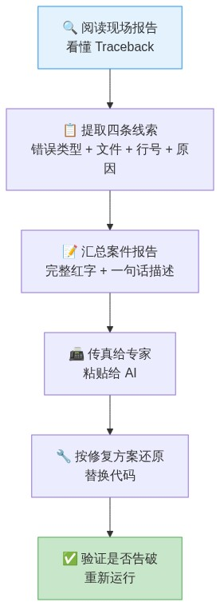
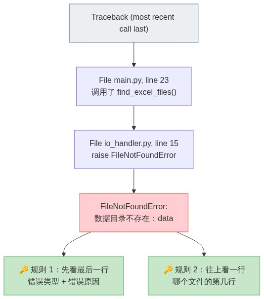
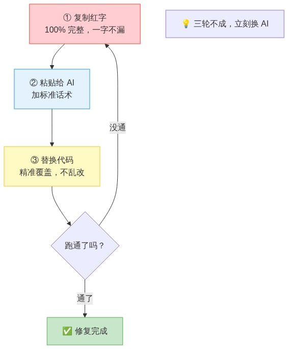
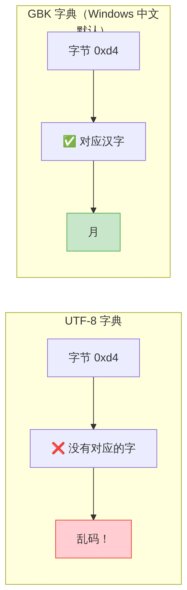
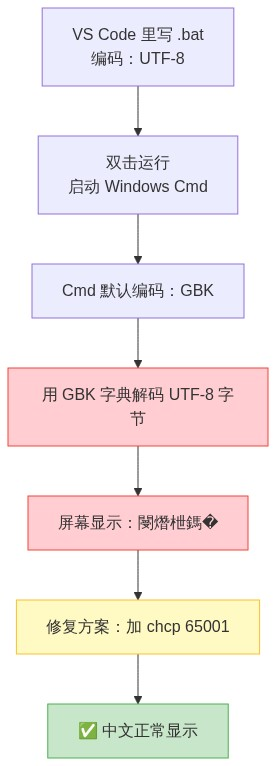

# 2.2 代码调试与排错：当红字出现时，你不是在"修 bug"，你是在"破案"

>💡 本章目标：学会看懂 Python 的报错信息（Traceback），掌握"贴回给 AI → AI 修复 → 再跑"的标准排错流程，并认识最常见的三类报错——路径错误、编码错误、模块缺失——以及它们的"一眼定位法"。学完本章，红字不再是恐慌信号，而是你拿来喂给 AI 的"案件线索"。

代码跑不通，不是"你失败了"，是 **100% 正常的**。即便是写了十年 Python 的工程师，第一遍跑新代码也不到一半概率一次过。区别只在于：他们看到满屏红字时不慌——他们知道红字在说什么。

本章就是教你"听懂红字在说什么"。不用学编程语法，只需要学会像读导航一样读报错。

---

## 〇、先建立心态：你不是在修 bug，你是在破案

把程序报错想象成**犯罪现场**。你的角色不是"修理工"，而是**侦探**。



整个排错过程就是：阅读现场报告（看懂 Traceback）→ 提取四条线索 → 汇总报告 → 传真给专家（粘贴给 AI）→ 按修复方案还原现场（替换代码）→ 验证案件是否告破（重新运行）。

> ⚠️ **新手最常见的错误反应**：看到红字 → 关掉终端 → 假装没看见 → 去干别的事。报错不会自己消失，只会越积越多。**每次红字都是一条免费的案件线索——扔掉线索，案件永远破不了。**

---

## 一、读懂红字：Traceback 不是天书，是倒序导航

### 1. 一个真实 Traceback 的解剖

假设你的 `multi-table-merger` 项目在运行时爆了这样一段红字：

```python
Traceback (most recent call last):
  File "/d/CodeProjects/multi-table-merger/src/multi_table_merger/main.py", line 23, in main
    excel_files = find_excel_files(data_dir)
                  ^^^^^^^^^^^^^^^^^^^^^^^^^^^
  File "/d/CodeProjects/multi-table-merger/src/multi_table_merger/io_handler.py", line 15, in find_excel_files
    raise FileNotFoundError(f"数据目录不存在：{data_dir}，请先创建该目录并放入 Excel 文件。")
FileNotFoundError: 数据目录不存在：data，请先创建该目录并放入 Excel 文件。
```

**一步一步拆开看：**

```
① Traceback (most recent call last):     ← "以下是案发经过（从最早到最晚）"
                                           ← Python 从最外层开始，一层一层往里追

② File "...main.py", line 23, in main    ← 第一现场：main.py 第 23 行
    excel_files = find_excel_files(data_dir)
                                           ← 这行代码调用了 find_excel_files

③ File "...io_handler.py", line 15       ← 第二现场：io_handler.py 第 15 行
    raise FileNotFoundError(...)
                                           ← 进到 io_handler 内部，在这里炸了

④ FileNotFoundError: 数据目录不存在：data...← 最终判决：你要找的 data/ 目录不存在
```



### 2. Traceback 的阅读规则（只需要记两条）

```
规则 1：从最下面往上看。
        最后一行 = 错误类型 + 错误原因（最重要！先看这个）
        往上一行 = 报错发生在哪个文件的第几行
        再往上 = 是谁调用了它（调用链，新手可以先不看）

规则 2：只看你认识的文件名。
        如果 Traceback 的某一行指向了你的项目文件（比如 io_handler.py），
        重点关注这一行——问题大概率在你的代码里。
        如果指向了一堆你不认识的文件（比如 site-packages/pandas/...），
        不用管——99% 的情况是上游调用方式不对，不是库本身的 bug。
        如果整段红字全是你看不懂的英文库文件，完全不用费劲辨认——
        直接全选复制，整段扔给 AI。AI 比你更懂这些底层库。
```

### 3. 最常见的五种错误类型——一眼定位

| 错误类型 | 中文直译 | 通常意味着什么 | 告诉 AI 的关键词 |
|----------|---------|-------------|----------------|
| `FileNotFoundError` | 文件找不到 | 路径写错了、文件夹没建、文件名打错了 | "请检查文件路径是否正确，data/ 目录是否存在" |
| `ModuleNotFoundError` | 模块找不到 | 没导入、包名写错了、`uv add` 漏装了 | "运行前请确认是否已 uv add 该库" |
| `UnicodeDecodeError` | 编码读不懂 | 文件编码和程序假设的不一致（**素材 A**） | "文件可能是 GBK 编码，请用 encoding='utf-8' 或 'gbk' 读取" |
| `SyntaxError` | 语法错误 | 代码有拼写错误（少个括号、多个逗号） | "请检查第 X 行的语法" |
| `AttributeError` | 属性不存在 | 用了一个对象没有的功能（比如对数字调了 `.lower()`） | "请检查第 X 行，对象类型可能不对" |

> 💡 这个表不用背。每次报错时回来翻，对号入座就知道该跟 AI 说什么。

---

## 二、三段式排错法：标准操作流程（SOP）

这是整章最核心的内容。**把它练成肌肉记忆——以后每次报错都走这个流程，不跳过任何一步。**



### 第 ① 段：复制红字——100% 完整，一个字不漏

```
✅ 正确：选中从 "Traceback (most recent call last):" 到最后一行的全部内容
❌ 错误：只复制最后一行 "FileNotFoundError: ..."
❌ 错误：用自己的话描述 "运行报错了，说找不到文件"
```

**为什么必须复制全部？** 最后一行只告诉你"出了什么事"，前面几行告诉你"在哪里出的、怎么走到那里的"——AI 需要完整调用链才能精准定位。只给最后一行，等于报警时说"有小偷"但不说"在哪栋楼、几点、偷了什么"。

### 第 ② 段：粘贴给 AI——加一句标准话术

粘贴完红字后，在前面加上：

```
代码运行报错，以下是完整的错误信息，请帮我修复：
```

如果终端没有红字（程序没报错但结果不对），话术改成：

```
代码能跑，但输出结果不符合预期。实际输出是：[描述实际结果]
我期望的输出是：[描述期望结果]
请帮我找出问题并修复。
```

### 第 ③ 段：替换代码——精准覆盖，不乱改

AI 返回修复方案后：

1. 找到 AI 指出要修改的文件（比如 `io_handler.py`）
2. 在 VS Code 中打开该文件
3. 找到 AI 说"把这行改成……"的位置
4. 删掉旧行，粘贴新行（只改 AI 指定的部分，不要顺手"优化"其他地方）
5. 按 `Ctrl+S` 保存
6. 回到终端，重新运行 `uv run python -m multi_table_merger.main`

> ⚠️ **AI 有时候会直接给你整段重写的代码，而不是"改哪行"。** 如果 AI 返回的是完整的 `io_handler.py` 文件，不要手动对比每一行——直接把整个文件内容替换掉。手动对比不仅慢，更容易漏改导致"修了一个 bug 却引入了三个新 bug"。

> ⚠️ **新手避坑铁律：Python 对空格极其敏感！** 你肉眼看着对齐的两行代码，可能因为混用了 Tab 和空格导致 Python 不认。**如果你不确定怎么对齐，千万不要只替换几行。** 直接对 AI 说：`"请给我修改后的 [文件名] 的完整全部代码。"` 然后把原文件内容全选（`Ctrl+A`），直接全部替换。这能帮你避开 90% 的缩进格式错误。

### 三轮不成，立刻换人

```
同一段报错 → AI-1 修了 3 次还是不行
    ↓
换 AI-2（豆包 → DeepSeek，或反过来），把原始报错重新贴一遍
```

> 💡 为什么会这样？不同 AI 对同一个报错的分析角度可能完全不同。死磕一个 AI 到第 5 次，不如第 3 次就换。这不是 AI 行不行的问题——是侦探破案也有思维定势。换个侦探，换个思路。

---

## 三、实战演练：给 multi-table-merger 制造三个典型 bug

理论讲完，现在用 `multi-table-merger` 项目来做"压力测试"——故意制造三个最常见的 bug，走一遍从报错到修复的完整流程。（如果你还没建这个项目，翻回第 2.1 章，按"四步验收"那一节的流程，让 AI 帮你生成完整代码。）

### Bug 1："明明有 data/ 文件夹，它说找不到"

**你怎么制造的**：把 `main.py` 里 `data_dir = "data"` 改成了 `data_dir = "dat a"`（多加了一个空格）。

**终端报错**：

```python
Traceback (most recent call last):
  File ".../main.py", line 21, in main
    excel_files = find_excel_files(data_dir)
  File ".../io_handler.py", line 10, in find_excel_files
    raise FileNotFoundError(f"数据目录不存在：{data_dir}")
FileNotFoundError: 数据目录不存在：dat a
```

**你按三段式操作**：

```
① 复制整段红字
② 粘贴到 DeepSeek，前面加："代码运行报错，以下是完整的错误信息，请帮我修复："
③ AI 回复："问题出在 main.py 第 21 行附近，data_dir 变量的值是 'dat a'（多了一个空格）。
    请找到 data_dir = 'dat a' 这一行，改成 data_dir = 'data'。"
④ 替换 → Ctrl+S → uv run python -m multi_table_merger.main → ✅ 跑通了
```

**这个 bug 教你的**：`FileNotFoundError` 不一定是"文件夹真的不存在"——也可能是路径字符串写错了。**检查路径拼写永远是第一步。**

---

### Bug 2（素材 A）：openpyxl 读 CSV 报编码错误

**场景**：同事用 Excel 导出了一个 CSV 文件（不是 .xlsx），你把它丢进 `data/` 目录。你的 `io_handler.py` 用 `pd.read_excel()` 去读，但读的是 `.csv` 文件——或者同事的 CSV 文件用的是 GBK 编码而非 UTF-8。

**你怎么制造的**：在 `data/` 目录下放一个用 Excel "另存为 CSV" 生成的文件（Excel 导出的 CSV 默认编码是带 BOM 的 UTF-8，但在某些 Windows 版本上是 GBK）。

**终端报错**：

```python
Traceback (most recent call last):
  File ".../main.py", line 30, in main
    df = read_excel(f)
  File ".../io_handler.py", line 22, in read_excel
    return pd.read_excel(filepath, engine="openpyxl")
  ...
UnicodeDecodeError: 'utf-8' codec can't decode byte 0xd4 in position 15: invalid continuation byte
```

**为什么会出现这个错误？**

把文件编码想象成"字典"——同一个数字在不同字典里对应不同的汉字。看下面这张图就明白了：



Windows 中文系统上，Excel 导出的文件默认使用 GBK 编码（国标扩展码），而 Python 的 `pd.read_excel()` 和 `open()` 默认假设文件是 UTF-8 编码。**字典不匹配 → 读出来是乱码 → Python 直接报错。**

**你按三段式操作**：

```
① 复制整段红字
② 粘贴到 AI，前面加：
   "代码运行报错，UnicodeDecodeError。我的数据文件可能是 GBK 编码的（Windows Excel 导出的 CSV），
    请帮我修改 io_handler.py，让它在读取文件时自动处理编码问题。以下是错误信息："
   [粘贴 Traceback]
③ AI 返回修复方案：在读取函数里加上 encoding 参数
```

**修复后的 io_handler.py 关键行**：

```python
# ===== 修复前 =====
def read_excel(filepath: Path) -> pd.DataFrame:
    return pd.read_excel(filepath, engine="openpyxl")

# ===== 修复后 =====
def read_excel(filepath: Path) -> pd.DataFrame:
    # 如果是 .csv 文件，用 read_csv 并尝试多种编码
    if filepath.suffix.lower() == ".csv":
        # 先试 UTF-8（带 BOM），再试 GBK
        for encoding in ["utf-8-sig", "gbk", "utf-8"]:
            try:
                return pd.read_csv(filepath, encoding=encoding)
            except UnicodeDecodeError:
                continue
        # 都失败了再报错
        raise UnicodeDecodeError(f"无法识别文件编码：{filepath}")

    # .xlsx 文件正常读取
    return pd.read_excel(filepath, engine="openpyxl")
```

**这个 bug 教你的**：

> ⚠️ **编码是 Windows 中文环境最大的隐形坑。** 你的代码在 Mac 上完美运行，同事的 Windows 电脑上一跑就崩——99% 是编码问题。记住两句话：
>
> - **如果文件是你自己生成的**：生成时锁死 `encoding="utf-8"`
> - **如果文件是别人给你的**：读取时用"先 UTF-8，不对就 GBK"的兜底逻辑（让 AI 帮你写这个逻辑——你只需要告诉它"文件可能是 GBK 编码"）

---

### Bug 3（素材 B）：.bat 双击后中文变成"天书"

**场景**：你把 `run.bat` 发给同事，同事双击运行。终端窗口正常弹出了，但所有中文提示变成了一堆看不懂的乱码——比如：

```
閿熸枻鎷�鏃ユ湡鏍煎紡涓嶆纭�
```

而不是：

```
❌ 日期格式不正确
```

**为什么会出现这个错误？**

Windows 命令提示符（Cmd）和 VS Code 终端**使用不同的默认编码**。你的 `.bat` 文件是在 VS Code 里写的（UTF-8 编码），但双击运行时是 Windows Cmd 在执行（GBK 显示）。两套字典打架 → 中文全部变成乱码。

看下面这张图，一眼就懂：



**修复方法：在 `.bat` 文件的第一行（`@echo off` 后面）加上 `chcp 65001`**

```batch
@echo off
REM ① 强制 Cmd 窗口使用 UTF-8 编码（65001 = UTF-8 的代码页编号）
chcp 65001 >nul

REM ② 切换到脚本所在目录
cd /d "%~dp0"

REM ③ 运行主程序
uv run python -m multi_table_merger.main

REM ④ 暂停看结果
echo.
echo ============================================
echo  按任意键关闭本窗口...
pause >nul
```

`chcp 65001` 做了什么？它告诉 Windows Cmd："请用 UTF-8 字典来显示文字。" 一行命令，字典统一，乱码消失。

`>nul` 做了什么？它把 `chcp` 命令自身的输出信息（"Active code page: 65001"）吞掉不显示——让终端窗口干净整洁。

> ⚠️ **这个 bug 最难排查，因为它在你的电脑上根本不会出现。** 你全程在 VS Code 终端里跑，VS Code 终端是 UTF-8，所以你永远看不到乱码。但同事双击 `.bat` 时看到的就是天书。**这条 `chcp 65001` 必须成为所有 `.bat` 脚本的标配——就像出门必须带钥匙。**

---

## 四、进阶：让 AI 给你装"行车记录仪"——打印调试法

三段式排错法能解决 90% 的问题。剩下 10% ——程序不报错，跑完了，但结果不对。比如小王发现工资条里张三的工资算成了负数，但终端没有任何红字——不知道是哪一步算歪了。

这时候不需要去翻代码。你只需要对 AI 说一句万能话术：

```
程序跑通了但结果不对，我不知道哪里算错了。请在代码的关键步骤加上 print()，
把中间结果打印在终端里给我看。比如：读取完文件后打印"读取到几个文件"，
计算完工资后打印"张三的实发工资是多少"。
```

### AI 会做什么？

AI 会在你的代码的关键位置插入 `print()`，就像给程序装上了"行车记录仪"。修改后的代码会长这样：

```python
# ① 读取后打印
files = list(Path("data").glob("*.xlsx"))
print(f"📂 读取到 {len(files)} 个文件：")
for f in files:
    print(f"   - {f.name}")

# ② 合并后打印
df = pd.concat(dfs, ignore_index=True)
print(f"👥 合并后共 {len(df)} 人")

# ③ 计算后打印前 3 个人的明细
df["实发工资"] = df["基本工资"] + df["加班天数"] * 200 - df["请假天数"] * 150
print("💰 前 3 人工资明细：")
print(df[["姓名", "基本工资", "加班天数", "实发工资"]].head(3))
```

### 你做什么？

1. 把这版带 `print()` 的代码贴回 VS Code
2. 重新跑一遍
3. 看终端输出——不再是天书，而是你能看懂的中文信息：

```
📂 读取到 3 个文件：
   - tech-dept.xlsx
   - finance-dept.xlsx
   - admin-dept.xlsx
👥 合并后共 47 人
💰 前 3 人工资明细：
   姓名  基本工资  加班天数  实发工资
0  张三   8000      3      8450
1  李四   6500      0      6500
2  王五   9000      5      9500
```

你一眼就能看到哪一步的数据不对。然后把这个发现告诉 AI：`"合并后人数是 47 对，但王五的加班天数应该是 3 不是 5，请检查读取那一步。"`

> 💡 **这种方法在业界叫"打印调试法（Print Debugging）"，是黑客和工程师们用了 50 年的最朴素排错手段。** 但现在你不用自己写 print——你只需要用中文告诉 AI "在哪加 print"，AI 替你写。你依然是发号施令的那个人，终端里直接输出人话，你看人话找问题，找到问题再告诉 AI。**不要去代码里找 bug，让代码自己把 bug 喊出来。**

## 🧪 本章操作自检清单

逐项核对，全部打勾才算真正掌握：

- [ ] 能在终端报错时，找到 Traceback 的最后一行（错误类型 + 原因）
- [ ] 能找到 Traceback 中指向你自己项目文件的那一行（而不是指向第三方库的）
- [ ] 能对照"五种常见错误类型速查表"，一眼识别 `FileNotFoundError` / `ModuleNotFoundError` / `UnicodeDecodeError`
- [ ] 完整走完一次三段式排错法：复制全部红字 → 粘贴给 AI → AI 返回修复 → 替换代码 → 重新跑通
- [ ] 故意在 `main.py` 里把 `data_dir = "data"` 改错，走一遍 Bug 1 的修复流程
- [ ] 理解 `UnicodeDecodeError` 的本质：**字典不匹配**（文件 GBK ↔ 程序 UTF-8）
- [ ] 检查你的 `run.bat` 里是否有 `chcp 65001`——如果没有，现在加上
- [ ] 成功让 AI 给代码加了 print()，在终端里看到中间结果，并据此找出了数据不对的那一步

---

<div align="center">

[🏠 返回目录](./index.md) | [⏭️ 下一章：2.3 日常代码提交流程](./07-git-workflow.md)

</div>
